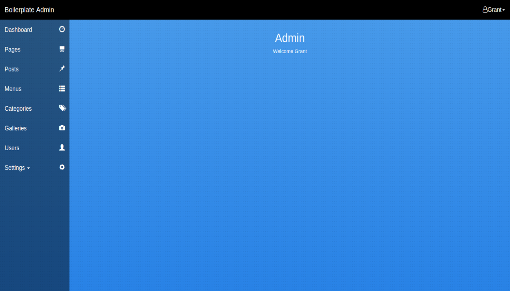

# React Boilerplate SSR

React Boilerplate Server Side Rendering with authentication, code-splitting,
Sass, Bootstrap, administration dashboard

<a href="https://github.com/hutchgrant/react-boilerplate-ssr/raw/master/docs/screenshots/screen_home.png"></a>
<a href="https://github.com/hutchgrant/react-boilerplate-ssr/raw/master/docs/screenshots/screen_login.png"></a>
<a href="https://github.com/hutchgrant/react-boilerplate-ssr/raw/master/docs/screenshots/screen_register.png"></a>
<a href="https://github.com/hutchgrant/react-boilerplate-ssr/raw/master/docs/screenshots/screen_admin.png"></a>

## Installation

```
git clone https://github.com/hutchgrant/react-boilerplate-ssr.git
cd ./react-boilerplate-ssr
npm install && npm install --prefix API
```

## Configure

This software has some dependencies and requires initial configuration before it
can be run successfully.

See
<a href="https://github.com/hutchgrant/react-boilerplate-ssr/blob/master/docs/README_CONFIG.md">config
documentation</a> for mongodb, session, cookie, social media(Google, Twitter,
Facebook) signin, recaptcha, API, configurations.

## Development

To start the environment in development mode:

```
npm run dev
```

This will launch the API on localhost:5000 and Client Renderer on localhost:3000
with monitors and hot loading.

## Production

For information about running this software in a development environment, see
<a href="https://github.com/hutchgrant/react-boilerplate-ssr/blob/master/docs/README_PROD.md">production
documentation</a>.

## License

React Boilerplate SSR is available under the
[MIT License](https://github.com/hutchgrant/react-boilerplate-ssr/blob/master/LICENSE).

## Contributing

All contributions will be placed under the same MIT license, contributers must
agree to that license. For more information see
[contributing](https://github.com/hutchgrant/react-boilerplate-ssr/blob/master/CONTRIBUTING.md).

## Author

**Grant Hutchinson (hutchgrant)**
